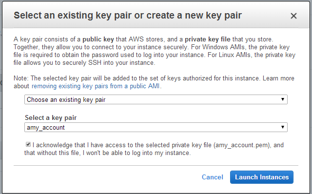
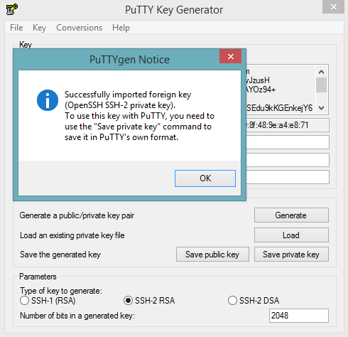
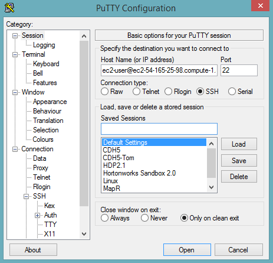

# On EC2 and S3 

>**Note**: This topic is no longer being maintained. Refer to the individual topics in the [Cloud Integration](https://github.com/h2oai/h2o-3/blob/master/h2o-docs/src/product/cloud-integration) folder for the most up-to-date documentation.

## On EC2

 >Tested on Redhat AMI, Amazon Linux AMI, and Ubuntu AMI

To use the Amazon Web Services (AWS) S3 storage solution, you will need to pass your S3 access credentials to H2O. This will allow you to access your data on S3 when importing data frames with path prefixes `s3n://...`.

For security reasons, we recommend writing a script to read the access credentials that are stored in a separate file. This will not only keep your credentials from propagating to other locations, but it will also make it easier to change the credential information later. 

## Standalone Instance

When running H2O in standalone mode using the simple Java launch command, we can pass in the S3 credentials in two ways. 

- You can pass in credentials in standalone mode by creating a `core-site.xml` file and pass it in with the flag `-hdfs_config`. For an example `core-site.xml` file, refer to [Core-site.xml](#Example). 

 1. Edit the properties in the core-site.xml file to include your Access Key ID and Access Key as shown in the following example:
   
	   ```
	   <property>
	      <name>fs.s3n.awsAccessKeyId</name>
	      <value>[AWS SECRET KEY]</value>
	    </property>

	    <property>
	      <name>fs.s3n.awsSecretAccessKey</name>
	      <value>[AWS SECRET ACCESS KEY]</value>
	    </property>
	    ```
  2. Launch with the configuration file `core-site.xml` by entering the following in the command line:

		java -jar h2o.jar -hdfs_config core-site.xml

  3. Import the data using importFile with the S3 url path:

     `s3n://bucket/path/to/file.csv`
 
  
- You can pass the AWS Access Key and Secret Access Key in an S3N Url in Flow, R, or Python (where `AWS_ACCESS_KEY` represents your user name and `AWS_SECRET_KEY` represents your password).
  
  - To import the data from the Flow API:

        `importFiles [ "s3n://<AWS_ACCESS_KEY>:<AWS_SECRET_KEY>@bucket/path/to/file.csv" ]`

  - To import the data from the R API:
  
        `h2o.importFile(path = "s3n://<AWS_ACCESS_KEY>:<AWS_SECRET_KEY>@bucket/path/to/file.csv")`

  - To import the data from the Python API:
  
        `h2o.import_file(path = "s3n://<AWS_ACCESS_KEY>:<AWS_SECRET_KEY>@bucket/path/to/file.csv")`
  
---
<a name="Multi"></a>
## Multi-Node Instance

>[Python](http://www.amazon.com/Python-and-AWS-Cookbook-ebook/dp/B005ZTO0UW/ref=sr_1_1?ie=UTF8&qid=1379879111&sr=8-1&keywords=python+aws) and the [`boto`](http://boto.readthedocs.org/en/latest/) Python library are required to launch a multi-node instance of H2O on EC2. Confirm these dependencies are installed before proceeding. 

For more information, refer to the [H2O EC2 repo](https://github.com/h2oai/h2o-3/tree/master/ec2). 

Build a cluster of EC2 instances by running the following commands on the host that can access the nodes using a public DNS name. 

1. Edit `h2o-cluster-launch-instances.py` to include your SSH key name and security group name, as well as any other environment-specific variables. 
        
   ```		
   ./h2o-cluster-launch-instances.py
   ./h2o-cluster-distribute-h2o.sh  
   ```		
 
    --OR--
		
   ```		  
   ./h2o-cluster-launch-instances.py
   ./h2o-cluster-download-h2o.sh
   ```		

   **Note**: The second method may be faster than the first, since download pulls from S3. 

2. Distribute the credentials using `./h2o-cluster-distribute-aws-credentials.sh`. 
  >**Note**: If you are running H2O using an IAM role, it is not necessary to distribute the AWS credentials to all the nodes in the cluster. The latest version of H2O can access the temporary access key. 

  >**Caution**: Distributing the AWS credentials copies the Amazon `AWS_ACCESS_KEY_ID` and `AWS_SECRET_ACCESS_KEY` to the instances to enable S3 and S3N access. Use caution when adding your security keys to the cloud. 

3. Start H2O by launching one H2O node per EC2 instance: 
  `./h2o-cluster-start-h2o.sh`
  
  Wait 60 seconds after entering the command before entering it on the next node. 
  
4. In your internet browser, substitute any of the public DNS node addresses for `IP_ADDRESS` in the following example:
  `http://IP_ADDRESS:54321`

  - To start H2O: `./h2o-cluster-start-h2o.sh`
  - To stop H2O: `./h2o-cluster-stop-h2o.sh`
  - To shut down the cluster, use your [Amazon AWS console](http://docs.aws.amazon.com/ElasticMapReduce/latest/DeveloperGuide/UsingEMR_TerminateJobFlow.html) to shut down the cluster manually. 

 >**Note**: To successfully import data, the data must reside in the same location on all nodes. 

---


<a name="Example"></a>
## Core-site.xml Example

The following is an example core-site.xml file: 


    <?xml version="1.0"?>
    <?xml-stylesheet type="text/xsl" href="configuration.xsl"?>

    <!-- Put site-specific property overrides in this file. -->

    <configuration>
    
        <!--
        <property>
        <name>fs.default.name</name>
        <value>s3n://<your s3 bucket></value>
        </property>
        -->
    
        <property>
            <name>fs.s3n.awsAccessKeyId</name>
            <value>insert access key here</value>
        </property>
    
        <property>
            <name>fs.s3n.awsSecretAccessKey</name>
            <value>insert secret key here</value>
        </property>
        </configuration> 
    
---

## Launching H2O

**Note**: Before launching H2O on an EC2 cluster, verify that ports `54321` and `54322` are both accessible by TCP. 

### Selecting the Operating System and Virtualization Type

Select your operating system and the virtualization type of the prebuilt AMI on Amazon. If you are using Windows, you will need to use a hardware-assisted virtual machine (HVM). If you are using Linux, you can choose between para-virtualization (PV) and HVM. These selections determine the type of instances you can launch. 

  

For more information about virtualization types, refer to [Amazon](http://docs.aws.amazon.com/AWSEC2/latest/UserGuide/virtualization_types.html).

--- 

### Configuring the Instance

1. Select the IAM role and policy to use to launch the instance. H2O detects the temporary access keys associated with the instance, so you don't need to copy your AWS credentials to the instances. 

  

2. When launching the instance, select an accessible key pair. 

  

---

#### (Windows Users) Tunneling into the Instance

For Windows users that do not have the ability to use `ssh` from the terminal, either download Cygwin or a Git Bash that has the capability to run `ssh`:

`ssh -i amy_account.pem ec2-user@54.165.25.98`

Otherwise, download PuTTY and follow these instructions:

1. Launch the PuTTY Key Generator. 
2. Load your downloaded AWS pem key file. 
   **Note:** To see the file, change the browser file type to "All". 
3. Save the private key as a .ppk file. 

  

4. Launch the PuTTY client. 
5. In the *Session* section, enter the host name or IP address. For Ubuntu users, the default host name is `ubuntu@<ip-address>`. For Linux users, the default host name is `ec2-user@<ip-address>`.  

  

6. Select *SSH*, then *Auth* in the sidebar, and click the **Browse** button to select the private key file for authentication. 

  
7. Start a new session and click the **Yes** button to confirm caching of the server's rsa2 key fingerprint and continue connecting. 

  

---

### Downloading Java and H2O


1. Download [Java](http://www.oracle.com/technetwork/java/javase/downloads/jdk7-downloads-1880260.html
) (JDK 1.7 or later) if it is not already available on the instance. 

2. To download H2O, run the `wget` command with the link to the zip file available on our [website](http://h2o.ai/download/) by copying the link associated with the **Download** button for the selected H2O build. 
	
		wget http://h2o-release.s3.amazonaws.com/h2o/{{branch_name}}/{{build_number}}/index.html
		unzip h2o-{{project_version}}.zip
		cd h2o-{{project_version}}
		java -Xmx4g -jar h2o.jar

3. From your browser, navigate to `<Private_IP_Address>:54321` or `<Public_DNS>:54321` to use H2O's web interface. 


